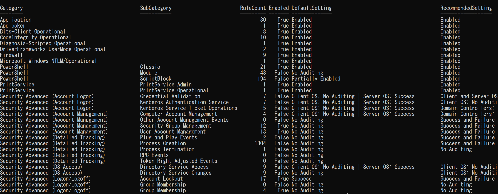
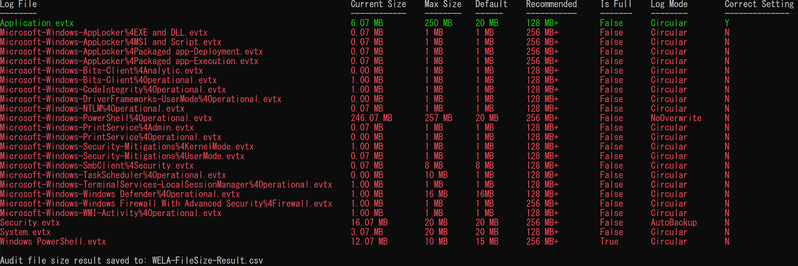

<div align="center">
 <p>
    
  <h1>
   WELA (Windows Event Log Auditor) ゑ羅
  </h1>
<div align="center">
 [ <a href="README">English</a> ] | [<b>日本語</b>]
</div>
 </p>
</div>

---

<p align="center">
    <a href="https://conference.auscert.org.au/speaker/fukusuke-takahashi/"></a>
    <a href="https://www.infosec-city.com/sin-25"></a>
    <a href="https://github.com/Yamato-Security/wela/commits/main/"></a>
    <a href="https://twitter.com/SecurityYamato"></a>
</p>


# WELAについて
**WELA（Windows Event Log Analyzer、ゑ羅）** は、Windowsイベントログの設定とログサイズを監査するツールです。
Windowsイベントログは、DFIR（デジタルフォレンジックおよびインシデント対応）に不可欠な情報源であり、システムの動作やセキュリティイベントを可視化します。
**しかし、デフォルト設定では、不十分なログサイズ、監査設定によって、脅威の検知漏れを引き起こす**可能性があります。
WELAはこうした課題を洗い出し、Windowsイベントログ設定改善のための実用的な提案を行います。
また、**実際のSigmaルールの検知範囲に基づいてWindowsイベントログ設定を評価**し、現状の設定で何が検知できるかを把握できます。


# 関連プロジェクト

* [EnableWindowsLogSettings](https://github.com/Yamato-Security/EnableWindowsLogSettings) Yamato SecurityのWindowsイベントログ設定ガイド
* [EventLog-Baseline-Guide](https://github.com/Yamato-Security/EventLog-Baseline-Guide) Sigmaルールと主要なガイドにおける検知ギャップを可視化するツール
* [WELA-RulesGenerator](https://github.com/Yamato-Security/WELA-RulesGenerator) WELAのSigmaルール関連設定ファイルを生成するためのツール

# 目次

- [WELAについて](#welaについて)
- [関連プロジェクト](#関連プロジェクト)
- [目次](#目次)
- [スクリーンショット](#スクリーンショット)
  - [スタートアップ](#スタートアップ)
  - [audit-settings (stdout)](#audit-settings-stdout)
  - [audit-settings (gui)](#audit-settings-gui)
  - [audit-settings (table)](#audit-settings-table)
  - [audit-settings (mitre-attack-navigator)](#audit-settings-mitre-attack-navigator)
  - [audit-filesize](#audit-filesize)
  - [configure](#configure)
- [機能](#機能)
- [前提要件](#前提要件)
- [ダウンロード](#ダウンロード)
- [WELAの実行](#welaの実行)
- [コマンド一覧](#コマンド一覧)
- [コマンド使用例](#コマンド使用例)
  - [audit-settings](#audit-settings)
      - [`audit-settings` command examples](#audit-settings-command-examples)
  - [audit-filesize](#audit-filesize-1)
      - [`audit-filesize` command examples](#audit-filesize-command-examples)
  - [configure](#configure)
       - [`configure` command examples](#configure-command-examples)
  - [update-rules](#update-rules)
      - [`update-rules` command examples](#update-rules-command-examples)
- [Windowsイベントログの監査設定に関するその他の参考資料](#windowsイベントログの監査設定に関するその他の参考資料)
- [貢献](#貢献)
- [不具合の報告](#不具合の報告)
- [ライセンス](#ライセンス)
- [貢献者](#貢献者)
- [謝辞](#謝辞)
- [X](#x)

# スクリーンショット

## スタートアップ


## audit-settings (stdout)

## audit-settings (gui)


## audit-settings (table)


## audit-settings (mitre-attack-navigator)


## audit-filesize


## configure


# 機能
- Windows Event Log Audit policyに対する評価
- 主要なWindowsイベントログ監査設定ガイドに基づくチェック
- Windows Event Logの監査設定を、実際のSigmaルールの検知範囲に基づいて評価
- Windows Event Logのファイルサイズを監査し、推奨サイズを提案
- 推奨されるWindowsイベントログ監査ポリシーとファイルサイズの設定

# 前提要件
* PowerShell 5.1+
* PowerShellをAdministrator権限で実行する

# ダウンロード

[リリースページ](https://github.com/Yamato-Security/wela/releases)から最新の安定版WELAをダウンロードしてください。

# WELAの実行
1.  [release zip file](https://github.com/Yamato-Security/wela/releases)を展開する。
2. **Administrator権限**でPowerShellを開く。
3. `./WELA.ps1 help`を実行する

# コマンド一覧
- `audit-settings`: Windowsイベントログ監査ポリシー設定を評価する
- `audit-filesize`: Windowsイベントログファイルサイズを評価する
- `configure`: 推奨のWindowsイベントログ監査ポリシーとファイズサイズを設定する
- `update-rules`: WELAのSigmaルール設定ファイルを更新する

# コマンド使用例
## audit-settings
`audit-settings`コマンドは、Windowsイベントログ監査ポリシー設定を評価し、[Yamato Security](https://github.com/Yamato-Security/EnableWindowsLogSettings)、[Microsoft(Sever/Client)](https://learn.microsoft.com/en-us/windows-server/identity/ad-ds/plan/security-best-practices/audit-policy-recommendations)、[Australian Signals Directorate (ASD)](https://www.cyber.gov.au/resources-business-and-government/maintaining-devices-and-systems/system-hardening-and-administration/system-monitoring/windows-event-logging-and-forwarding)の推奨設定と比較します。
RuleCountは、そのカテゴリ内のイベントを検出できる[Sigmaルール](https://github.com/SigmaHQ/sigma)の数を示します。

#### `audit-settings` command examples
YamatoSecurityの推奨設定でチェックし、CSV形式で保存する:
```
./WELA.ps1 audit-settings -BaseLine YamatoSecurity
```

Australian Signals Directorateの推奨設定でチェックし、CSV形式で保存する:
```
./WELA.ps1 audit-settings -BaseLine ASD
```

Microsoftの推奨設定(Server)でチェックし、GUI形式で表示する:
```
./WELA.ps1 audit-settings -BaseLine Microsoft_Server -OutType gui
```

Microsoftの推奨設定(Client)でチェックし、Table形式で表示する:
```
./WELA.ps1 audit-settings -BaseLine Microsoft_Client -OutType table
```

## audit-filesize
`audit-filesize`コマンドは、Windowsイベントログファイルサイズを評価し、Yamato Securityの推奨設定と比較します。

#### `audit-filesize` command examples
WindowsイベントログファイルサイズをYamatoSecurityの推奨設定でチェックし、CSV形式で保存する:
```
./WELA.ps1 audit-filesize --BaseLine YamatoSecurity
```

## configure 
`configure`コマンドは、推奨のWindowsイベントログ監査ポリシーとファイルサイズを設定します。

#### `configure` command examples
Yamato Securityの推奨設定を適用する（設定変更時に確認プロンプトを表示）:
```
./WELA.ps1 configure --BaseLine YamatoSecurity
```

Australian Signals Directorateの推奨設定を自動で適用する:
```
./WELA.ps1 configure --BaseLine ASD -auto
```

## update-rules
#### `update-rules` command examples
WELAのSigmaルール設定ファイルを更新する:
```
./WELA.ps1 update-rules
```

# Windowsイベントログの監査設定に関するその他の参考資料

* [A Data-Driven Approach to Windows Advanced Audit Policy – What to Enable and Why](https://www.splunk.com/en_us/blog/security/windows-audit-policy-guide.html)
* [Audit Policy Recommendations](https://learn.microsoft.com/en-us/windows-server/identity/ad-ds/plan/security-best-practices/audit-policy-recommendations)
* [Configure audit policies for Windows event logs](https://learn.microsoft.com/en-us/defender-for-identity/deploy/configure-windows-event-collection)
* [EnableWindowsLogSettings](https://github.com/Yamato-Security/EnableWindowsLogSettings)
* [Windows event logging and forwarding](https://www.cyber.gov.au/resources-business-and-government/maintaining-devices-and-systems/system-hardening-and-administration/system-monitoring/windows-event-logging-and-forwarding)
* [mdecrevoisier/Windows-auditing-baseline](https://github.com/mdecrevoisier/Windows-auditing-baseline)
* [palantir/windows-event-forwarding](https://github.com/palantir/windows-event-forwarding/tree/master/group-policy-objects)

# 貢献

わたしたちは、どんな形でも貢献を歓迎します。
プルリクエスト、ルール作成、サンプルログの提供が最も歓迎されますが、バグの報告や機能リクエストなども大歓迎です。

少なくとも、**私たちのツールやリソースが気に入ったら、GitHubでスターをつけて応援してください！**

# 不具合の報告

* 不具合の報告は、[こちら](https://github.com/Yamato-Security/wela/issues/new?assignees=&labels=bug&template=bug_report.md&title=%5Bbug%5D)からお願いします。
* このプロジェクトは現在も積極的にメンテナンスされており、バグの報告や機能のリクエストは大歓迎です。

# ライセンス

* WELAは、[MITライセンス](https://opensource.org/licenses/MIT)のもとでリリースされています。

# 貢献者

* Fukusuke Takahashi (コア開発者)
* Zach Mathis (プロジェクトリーダー, ツールデザイン, テスト,　など...) (@yamatosecurity)

# 謝辞

* [Australian Cyber Security Centre: Windows event logging and forwarding](https://www.cyber.gov.au/resources-business-and-government/maintaining-devices-and-systems/system-hardening-and-administration/system-monitoring/windows-event-logging-and-forwarding)
* [Microsoft: Advanced security auditing FAQ](https://learn.microsoft.com/en-us/previous-versions/windows/it-pro/windows-10/security/threat-protection/auditing/advanced-security-auditing-faq)
* [SigmaHQ](https://github.com/SigmaHQ/sigma)

# X

WELAの最新情報、ルールの更新、Yamato Securityの他のツールなどについては、X[@SecurityYamato](https://twitter.com/SecurityYamato)で発信しています。