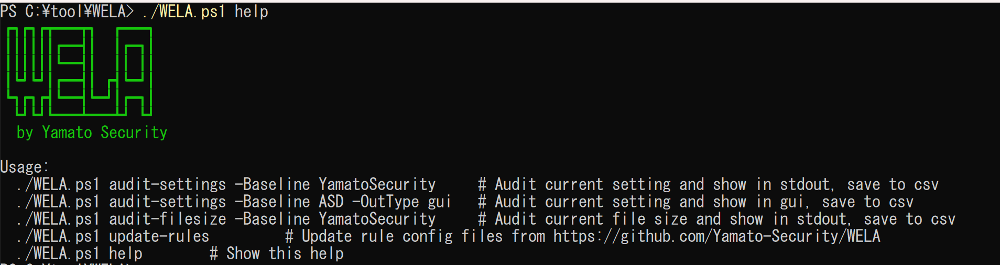
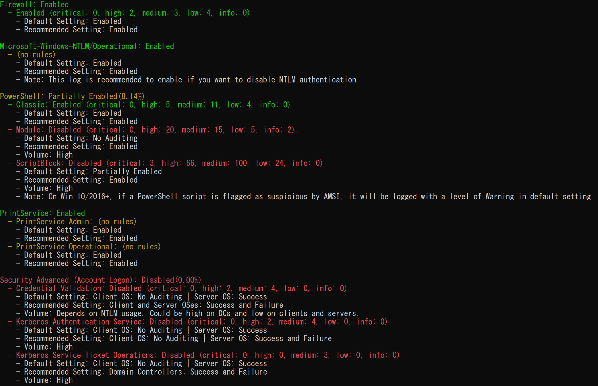
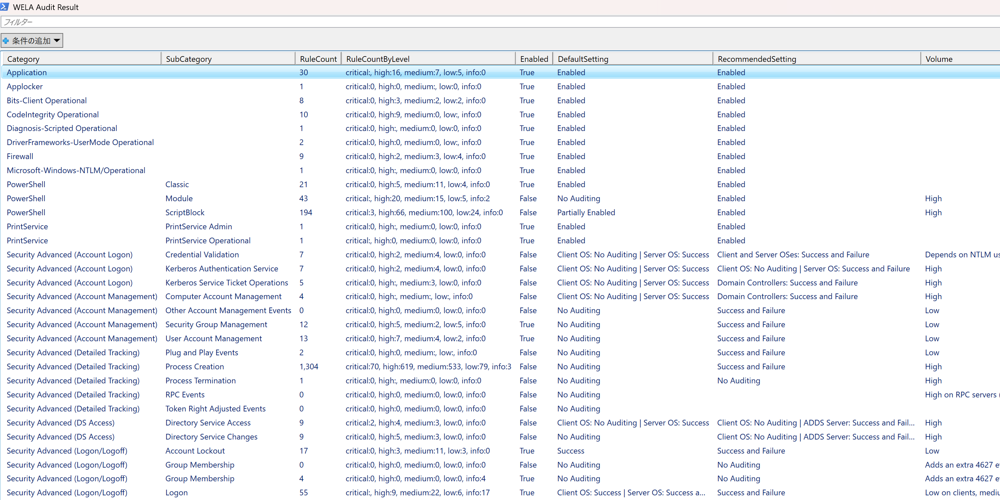
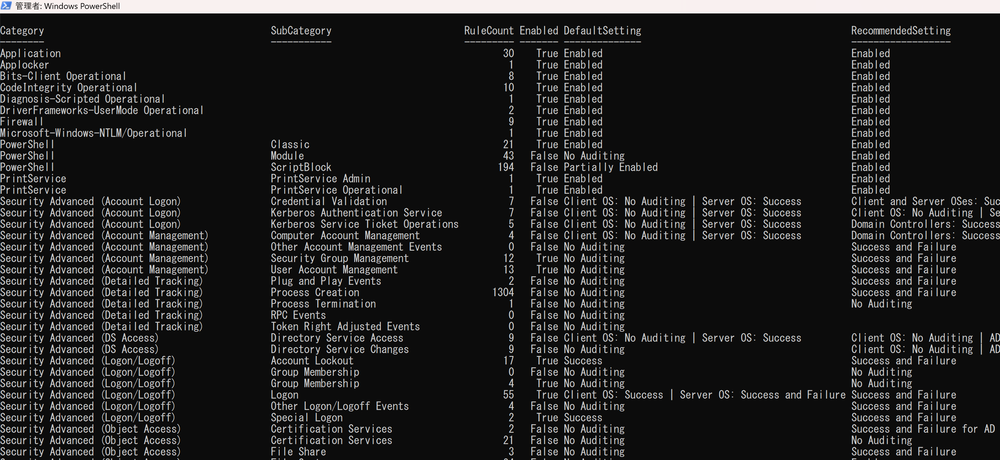
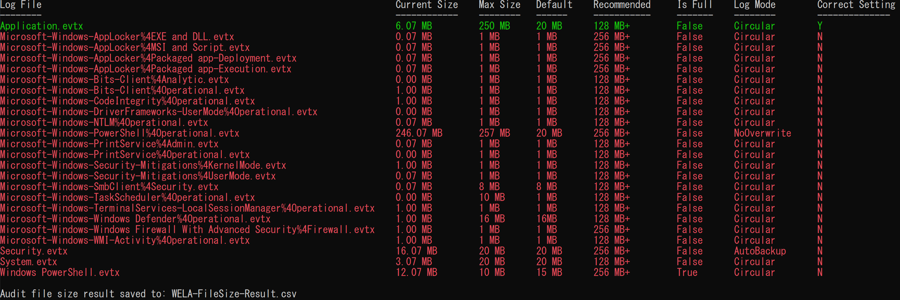

<div align="center">
 <p>
    
  <h1>
   WELA (Windows Event Log Auditor) ゑ羅
  </h1>
<div align="center">
 [ <b>English</b> ] | [<a href="README-Japanese.md">日本語</a>]
</div>
 </p>
</div>

---

<p align="center">
    <a href="https://github.com/Yamato-Security/wela/commits/main/"></a>
    <a href="https://twitter.com/SecurityYamato"></a>
</p>


# About WELA
**WELA (Windows Event Log Analyzer, ゑ羅) is a tool for auditing Windows Event Log settings and log file sizes**.
Windows Event Logs are essential for Digital Forensics and Incident Response (DFIR), offering insights into system activity and security events.
However, **Default Windows Event Log settings often cause issues—such as small log sizes, weak audit policies, and blind spots in detection**—that hinder effective investigations.
WELA helps identify these issues and provides actionable recommendations to improve log settings and strengthen security visibility.


# Companion Projects

* [EnableWindowsLogSettings](https://github.com/Yamato-Security/EnableWindowsLogSettings) Yamato Security's Windows Event Log Configuration Guide For DFIR And Threat Hunting.
* [EventLog-Baseline-Guide](https://github.com/Yamato-Security/EventLog-Baseline-Guide) A tool to visualize detection gaps in Sigma rules and major Windows Event Log configuration guides.
* [WELA-RulesGenerator](https://github.com/Yamato-Security/WELA-RulesGenerator) A tool for generating WELA's Sigma rule-related config files.

# Table of Contents

- [About WELA](#about-wela)
- [Companion Projects](#companion-projects)
- [Table of Contents](#table-of-contents)
- [Screenshots](#screenshots)
- [Features](#features)
- [Downloads](#downloads)
- [Command List](#command-list)
- [Command Usage](#command-usage)
  - [audit-settings](#audit-settings)
  - [audit-filesize](#audit-filesize)
  - [update-rules](#update-rules)
- [Contribution](#contribution)
- [Bug Submission](#bug-submission)
- [License](#license)
- [Contributors](#contributors)
- [Acknowledgements](#acknowledgements)
- [Twitter](#twitter)

# Screenshots

## Startup


## audit-settings (stdout)

## audit-settings (gui)


## audit-settings (table)


## audit-filesize


# Features
- Audit Windows Event Log Audit policy settings.
- Checking **based on the major Windows Event Log Audit configuration guides**.
- Checking Windows Event Log audit settings based on **real-world Sigma rule detectability**.
- Audit Windows Event Log file sizes and suggest the recommended size.

# Prerequisites
* PowerShell 5.1+
* Run PowerShell with Administrator privileges

# Downloads

Please download the latest stable version of WELA from the [Releases](https://github.com/Yamato-Security/wela/releases) page.

# Running WELA
1. Unzip the [release zip file](https://github.com/Yamato-Security/wela/releases).
2. Open PowerShell with **Administrator privileges**.
3. `./WELA.ps1 help` to run WELA.

# Command List
- `audit-settings`: Check Windows Event Log audit policy settings.
- `audit-filesize`: Check Windows Event Log file size.
- `update-rules`: Update WELA's Sigma rules config files.

# Command Usage
## audit-settings
`audit-settings` command checks the Windows Event Log audit policy settings and compares them with the recommended settings from **[Yamato Security](https://github.com/Yamato-Security/EnableWindowsLogSettings)**, **[Microsoft(Sever/Client)](https://learn.microsoft.com/en-us/windows-server/identity/ad-ds/plan/security-best-practices/audit-policy-recommendations)**, and **[Australian Signals Directorate (ASD)](https://www.cyber.gov.au/resources-business-and-government/maintaining-devices-and-systems/system-hardening-and-administration/system-monitoring/windows-event-logging-and-forwarding)**.
RuleCount indicates the number of [Sigma rules](https://github.com/SigmaHQ/sigma) that can detect events within that category.

#### `audit-settings` command examples
Check by YamatoSecurity(Default) recommend setting and save to CSV:  
```
./WELA.ps1 audit-settings
```

Check by Australian Signals Directorate recommend setting and save to CSV:  
```
./WELA.ps1 audit-settings -BaseLine ASD
```

Check by Microsoft recommend setting (Server) and Display results in GUI:  
```
./WELA.ps1 audit-settings -BaseLine Microsoft_Server -OutType gui
```

Check by Microsoft recommend setting (Client) and Display results in Table format:  
```
./WELA.ps1 audit-settings -BaseLine Microsoft_Client -OutType table
```

## audit-filesize
`audit-filesize` command checks the Windows Event Log file size and compares it with the recommended settings from **Yamato Security**.

#### `audit-filesize` command examples
Check Windows Event Log file size by YamatoSecurity recommended settings and save to CSV:  
```
./WELA.ps1 audit-filesize
```

## update-rules
#### `update-rulese` command examples
Update WELA's Sigma rules config files:  
```
./WELA.ps1 update-rules
```

# Other Windows Event Log Audit Related Resources

* [EnableWindowsLogSettings](https://github.com/Yamato-Security/EnableWindowsLogSettings) Yamato Security's Windows Event Log Configuration Guide For DFIR And Threat Hunting.
* [Audit Policy Recommendations](https://learn.microsoft.com/en-us/windows-server/identity/ad-ds/plan/security-best-practices/audit-policy-recommendations)
* [Windows event logging and forwarding](https://www.cyber.gov.au/resources-business-and-government/maintaining-devices-and-systems/system-hardening-and-administration/system-monitoring/windows-event-logging-and-forwarding)
* [A Data-Driven Approach to Windows Advanced Audit Policy – What to Enable and Why](https://www.splunk.com/en_us/blog/security/windows-audit-policy-guide.html)

# Contribution

We would love any form of contribution.
Pull requests, rule creation, and sample logs are the best, but feature requests notifying us of bugs, etc... are also very welcome.

At the least, **if you like our tools and resources, then please give us a star on GitHub and show your support!**

# Bug Submission

* Please submit any bugs you find [here.](https://github.com/Yamato-Security/wela/issues/new?assignees=&labels=bug&template=bug_report.md&title=%5Bbug%5D)
* This project is currently actively maintained, and we are happy to fix any bugs reported.

# License

* WELA is released under [MIT License](https://opensource.org/licenses/MIT)

# Contributors

* Fukusuke Takahashi (core developer)
* Zach Mathis (project leader, tool design, testing, etc...) (@yamatosecurity)

# Acknowledgements

* [SigmaHQ](https://github.com/SigmaHQ/sigma)

# Twitter

You can receive the latest news about WELA, rule updates, other Yamato Security tools, etc... by following us on Twitter at [@SecurityYamato](https://twitter.com/SecurityYamato).