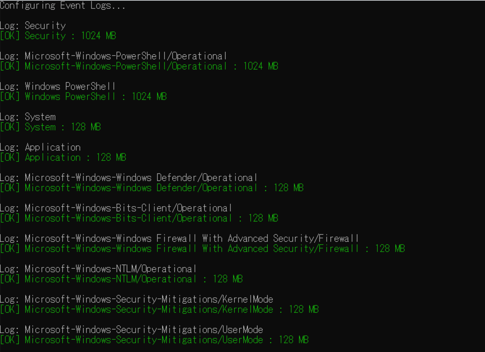

<div align="center">
 <p>
    
  <h1>
   WELA (Windows Event Log Auditor) ゑ羅
  </h1>
<div align="center">
 [ <b>English</b> ] | [<a href="README-Japanese.md">日本語</a>]
</div>
 </p>
</div>

---

<p align="center">
    <a href="https://conference.auscert.org.au/speaker/fukusuke-takahashi/"></a>
    <a href="https://www.infosec-city.com/sin-25"></a>
    <a href="https://github.com/Yamato-Security/wela/commits/main/"></a>
    <a href="https://twitter.com/SecurityYamato"></a>
</p>


# About WELA
**WELA (Windows Event Log Analyzer, ゑ羅)** is a tool for auditing Windows event log settings.
Windows event logs are a vital source of information for Digital Forensics and Incident Response (DFIR), providing visibility into system activity and security events.
**Unfortunately, default configurations often lead to problems such as limited log retention, insufficient audit policies, and blind spots that reduce detection capability**.
WELA helps uncover these weaknesses and offers practical recommendations to improve audit settings and enhance security visibility.
WELA also assesses log configurations **based on real-world Sigma rule coverage**, allowing users to evaluate what can or cannot be detected under current the settings.


# Companion Projects

* [EnableWindowsLogSettings](https://github.com/Yamato-Security/EnableWindowsLogSettings): Yamato Security's Windows Event Log Configuration Guide.
* [EventLog-Baseline-Guide](https://github.com/Yamato-Security/EventLog-Baseline-Guide): A tool to visualize detection gaps in Sigma rules and major guides.
* [WELA-RulesGenerator](https://github.com/Yamato-Security/WELA-RulesGenerator): A tool for generating WELA's Sigma rule-related config files.

# Table of Contents

- [About WELA](#about-wela)
- [Companion Projects](#companion-projects)
- [Table of Contents](#table-of-contents)
- [Screenshots](#screenshots)
  - [Startup Help Menu](#startup-help-menu)
  - [audit-settings (terminal output)](#audit-settings-terminal-output)
  - [audit-settings (GUI)](#audit-settings-gui)
  - [audit-settings (table)](#audit-settings-table)
  - [audit-filesize](#audit-filesize)
  - [configure](#configure)
- [Features](#features)
- [Prerequisites](#prerequisites)
- [Downloads](#downloads)
- [Running WELA](#running-wela)
- [Command List](#command-list)
- [Command Usage](#command-usage)
  - [audit-settings](#audit-settings)
    - [`audit-settings` command examples](#audit-settings-command-examples)
  - [audit-filesize](#audit-filesize-1)
    - [`audit-filesize` command examples](#audit-filesize-command-examples)
  - [configure](#configure)
    - [`configure` command examples](#configure-command-examples)
  - [update-rules](#update-rules)
      - [`update-rules` command examples](#update-rules-command-examples)
- [Other Windows Event Log Audit Settings Related Resources](#other-windows-event-log-audit-settings-related-resources)
- [Contributions](#contributions)
- [Bug Submission](#bug-submission)
- [License](#license)
- [Contributors](#contributors)
- [Acknowledgements](#acknowledgements)
- [Twitter](#twitter)

# Screenshots

## Startup Help Menu


## audit-settings (terminal output)

## audit-settings (GUI)


## audit-settings (table)


## audit-filesize


## configure


# Features
- Auditing Windows event log audit policy settings.
- Checking **based on the major Windows event log audit configuration guidelines**.
- Checking Windows event log audit settings based on **real-world Sigma rule detectability**.
- Auditing of Windows event log file sizes and suggestions for the recommended size.
- Setting recommended Windows event log audit policy and file sizes.

# Prerequisites
* Windows PowerShell 5.1 or PowerShell Core
* Running PowerShell with Administrator privileges

# Downloads

Please download the latest stable version of WELA from the [Releases](https://github.com/Yamato-Security/wela/releases) page.

# Running WELA
1. Unzip the [release zip file](https://github.com/Yamato-Security/wela/releases).
2. Open PowerShell with **Administrator privileges**.
3. `./WELA.ps1 help` to run WELA and see the help usage.

# Command List
- `audit-settings`: Check Windows event log audit policy settings.
- `audit-filesize`: Check Windows event log file size.
- `configure`: Configure recommended Windows event log audit policy and file size.
- `update-rules`: Update WELA's Sigma rules config files.

# Command Usage
## audit-settings
The `audit-settings` command checks the Windows event log audit policy settings and compares them with the recommended settings from [Yamato Security](https://github.com/Yamato-Security/EnableWindowsLogSettings), [Microsoft(Sever/Client)](https://learn.microsoft.com/en-us/windows-server/identity/ad-ds/plan/security-best-practices/audit-policy-recommendations), and [Australian Signals Directorate (ASD)](https://www.cyber.gov.au/resources-business-and-government/maintaining-devices-and-systems/system-hardening-and-administration/system-monitoring/windows-event-logging-and-forwarding).
`RuleCount` indicates the number of [Sigma rules](https://github.com/SigmaHQ/sigma) that can detect events within that category.

### `audit-settings` command examples
Check with the default Yamato Security's recommended settings and save results to CSV:  
```
./WELA.ps1 audit-settings -BaseLine YamatoSecurity
```

Check with the Australian Signals Directorate's recommended settings and save results to CSV:  
```
./WELA.ps1 audit-settings -BaseLine ASD
```

Check with Microsoft's recommended Server OS settings and display results in a GUI:  
```
./WELA.ps1 audit-settings -BaseLine Microsoft_Server -OutType gui
```

Check with Microsoft's recommended Client OS settings and display results in table format:  
```
./WELA.ps1 audit-settings -BaseLine Microsoft_Client -OutType table
```

## audit-filesize
The `audit-filesize` command checks the Windows event logs' file size and compares them with the recommended settings from Yamato Security's recommendations.

### `audit-filesize` command examples
Check the Windows event log file size with Yamato Security's recommendations and save results to CSV:  
```
./WELA.ps1 audit-filesize -BaseLine YamatoSecurity
```

## configure
The `configure` command sets the recommended Windows event log audit policy and file size.

#### `configure` command examples
Apply Yamato Security's recommended settings (with confirmation prompt before changing settings):
```
./WELA.ps1 configure --BaseLine YamatoSecurity
```

Apply Australian Signals Directorate's recommended settings without confirmation prompt:
```
./WELA.ps1 configure --BaseLine ASD -auto
```


## update-rules
#### `update-rules` command examples
Update WELA's Sigma rules config files:  
```
./WELA.ps1 update-rules
```

# Other Windows Event Log Audit Settings Related Resources

* [A Data-Driven Approach to Windows Advanced Audit Policy – What to Enable and Why](https://www.splunk.com/en_us/blog/security/windows-audit-policy-guide.html)
* [Audit Policy Recommendations](https://learn.microsoft.com/en-us/windows-server/identity/ad-ds/plan/security-best-practices/audit-policy-recommendations)
* [Configure audit policies for Windows event logs](https://learn.microsoft.com/en-us/defender-for-identity/deploy/configure-windows-event-collection)
* [EnableWindowsLogSettings](https://github.com/Yamato-Security/EnableWindowsLogSettings)
* [Windows event logging and forwarding](https://www.cyber.gov.au/resources-business-and-government/maintaining-devices-and-systems/system-hardening-and-administration/system-monitoring/windows-event-logging-and-forwarding)
* [mdecrevoisier/Windows-auditing-baseline](https://github.com/mdecrevoisier/Windows-auditing-baseline)
* [palantir/windows-event-forwarding](https://github.com/palantir/windows-event-forwarding/tree/master/group-policy-objects)

# Contributions

We would love any form of contribution.
Pull requests are the best, but feature requests notifying us of bugs, etc... through issues are also very welcome.

At the least, **if you like our tools and resources, then please give us a star on GitHub and show your support!**

# Bug Submission

* Please submit any bugs you find [here.](https://github.com/Yamato-Security/wela/issues/new?assignees=&labels=bug&template=bug_report.md&title=%5Bbug%5D)
* This project is currently actively maintained, and we are happy to fix any bugs reported.

# License

* WELA is released under the [MIT License](https://opensource.org/licenses/MIT).

# Contributors

* Fukusuke Takahashi (core developer)
* Zach Mathis (project leader, tool design, testing, etc...) (@yamatosecurity)

# Acknowledgements

* [Australian Cyber Security Centre: Windows event logging and forwarding](https://www.cyber.gov.au/resources-business-and-government/maintaining-devices-and-systems/system-hardening-and-administration/system-monitoring/windows-event-logging-and-forwarding)
* [Microsoft: Advanced security auditing FAQ](https://learn.microsoft.com/en-us/previous-versions/windows/it-pro/windows-10/security/threat-protection/auditing/advanced-security-auditing-faq)
* [SigmaHQ](https://github.com/SigmaHQ/sigma)

# Twitter

You can receive the latest news about WELA, rule updates, other Yamato Security tools, etc... by following us on Twitter at [@SecurityYamato](https://twitter.com/SecurityYamato).