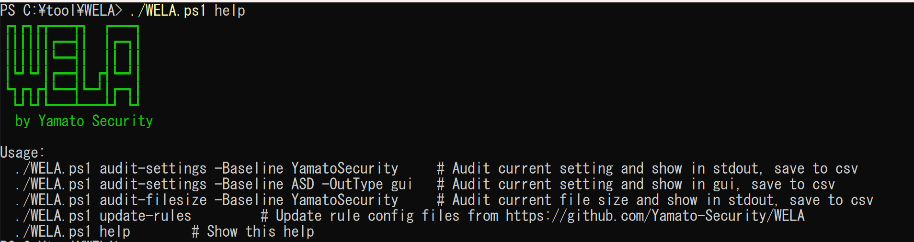
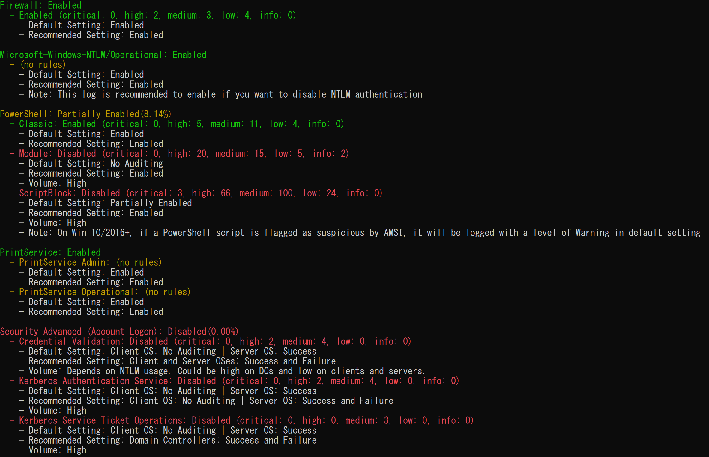
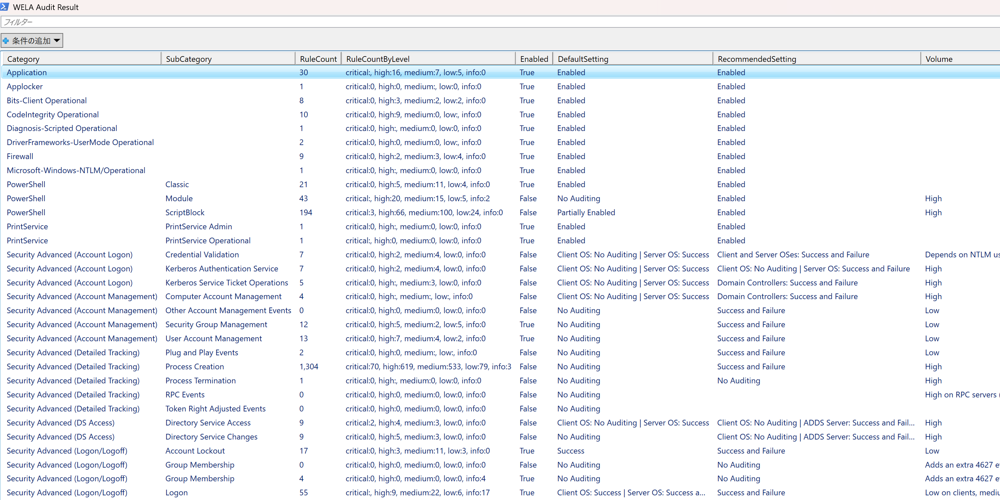
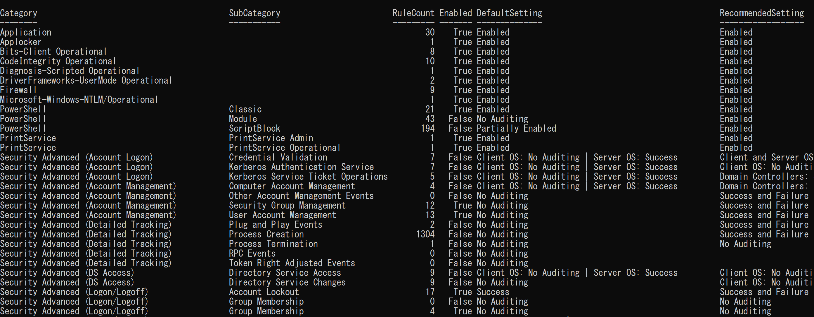
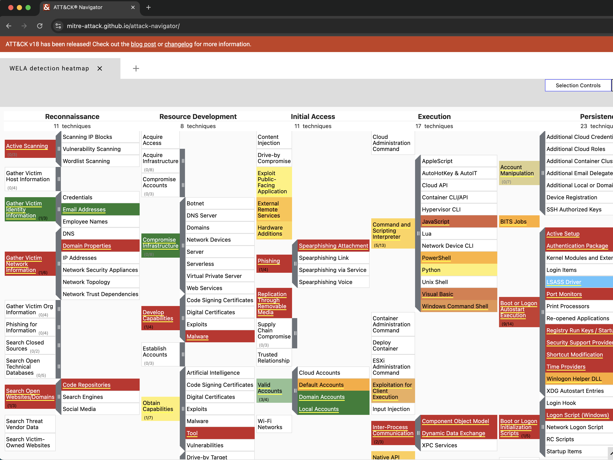
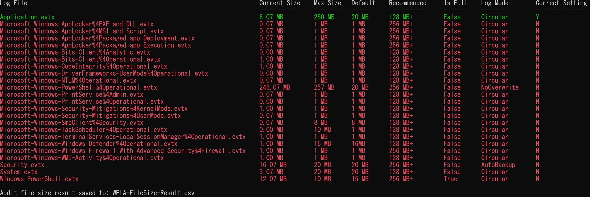
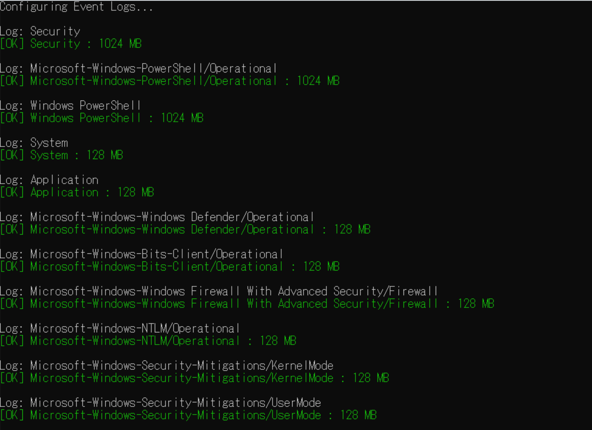

# Знімки екрана

## Меню довідки під час запуску

## audit-settings (вивід у терміналі)

## audit-settings (графічний інтерфейс)

## audit-settings (таблиця)

## audit-settings (mitre-attack-navigator)

## audit-filesize

## configure

